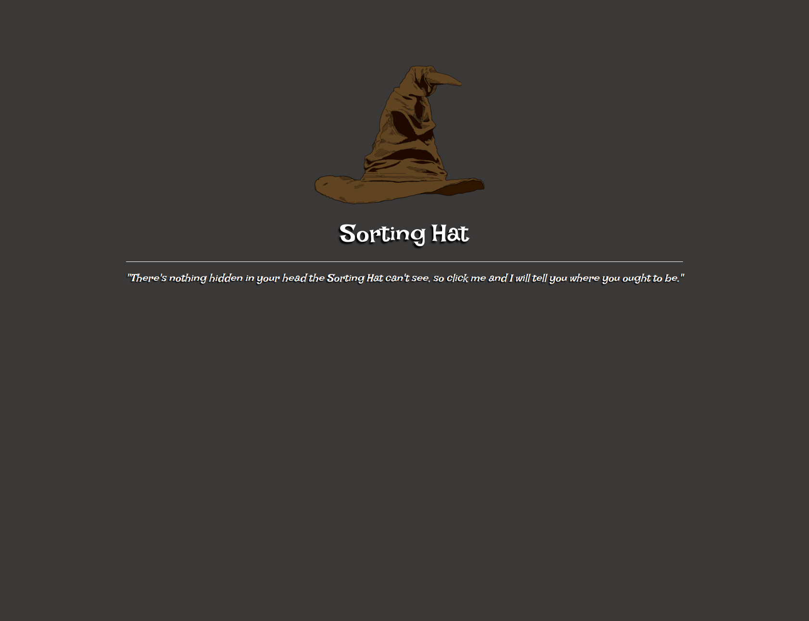
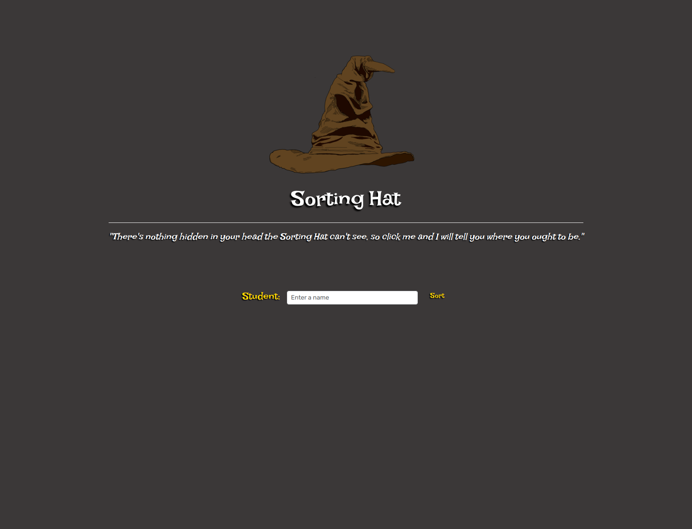
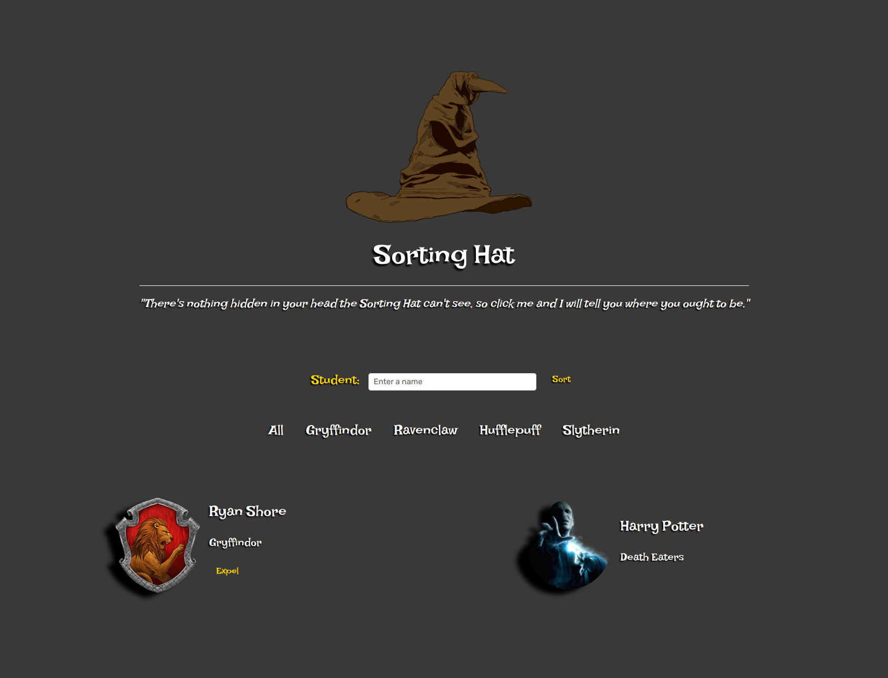

# Sorting Hat 

Sorting Hat is an application that will let you and your friends find out which house you would be sorted to during your first year at Hogwarts. Be careful! You can even get EXPELLED if *He-Who-Must-Not-Be-Named* holds too much influence over your mind!

## About the User 
- The ideal user for this application is someone who is a "DM" for a Harry Potter tabletop campaign.
- They can sort members of their party into different houses at the start of the game and depending on the member's actions can expel them throughout the game.
- The problem this app solves for them is it allows them to randomize party composition to keep the game interesting each campaign. 

## Features 
- When a new student is added a student card renders to the DOM.
- The house crest of the sorted house is displayed on the student's card along with the student name and house name.
- The student cards can be sorted by house with the filter buttons.
- When you press **Expel** on a student card it removes that student from the student container and puts it into the Death Eaters container.

## Video Walkthrough of Sorting Hat <!-- A loom link is sufficient -->

<iframe src="https://www.loom.com/embed/1dbc3997e22f4c16beb4bb775bcdbcc7?sid=91fa19f5-7b25-4385-83b0-fc228bf8f736" frameborder="0" webkitallowfullscreen mozallowfullscreen allowfullscreen style="position: absolute; top: 0; left: 0; width: 100%; height: 100%;"></iframe>

## Relevant Links
- [View App](https://rs-sorting-hat.netlify.app/)
- [Wireframes](https://www.figma.com/file/QnvwFZ5mqYVXemoUhALJLX/Sorting-Hat?type=whiteboard&node-id=0%3A1&t=X0R46f2IZQ8LDuwa-1)
- [Project Board](https://github.com/users/mshorecode/projects/2/views/1?layout=table)
## Project Screenshots <!-- These can be inside of your project. Look at the repos from class and see how the images are included in the readme -->

## Contributors
Ryan Shore [ https://github.com/mshorecode ]
